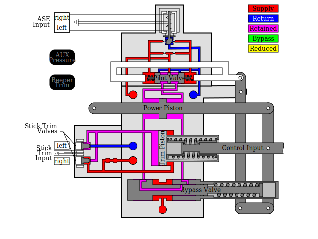

# AuxBlockSVG

This is an SVG (Scalable Vector Graphics, an internet graphics format) which shows how
the Sea King Auxiliary Hydraulic control block (Aux Block) operates. It is drawn completely with
native SVG graphics (no bitmaps), a grouped by component. Javascript is used to allow
the Aux Block to respond to inputs as follows:
- Aux Pressure can be turned on / off
- Beeper Trim can be turned on / off
- The Control Input can be dragged left and right
- ASE input can be set proportionally
- The trim can be adjusted left or right.
  
